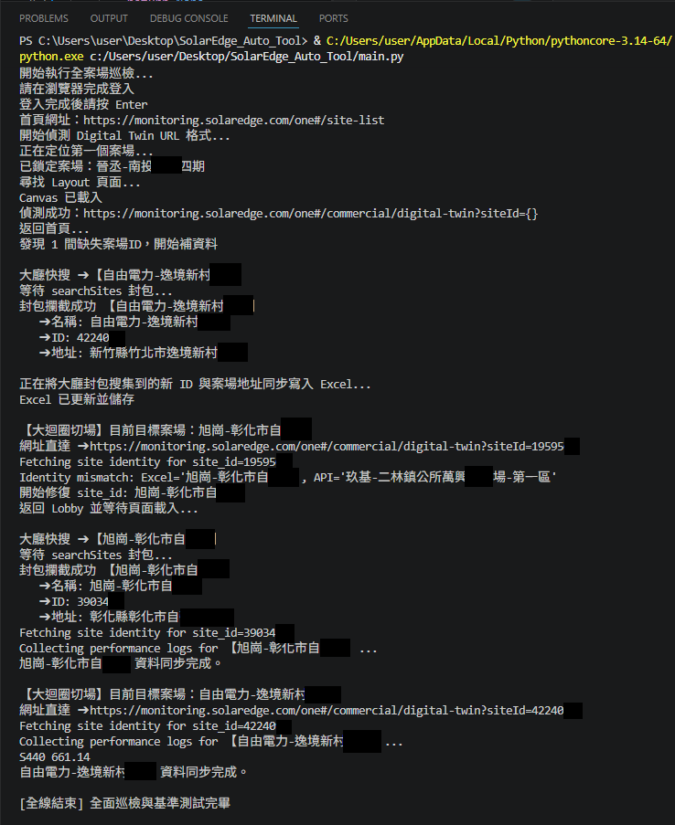
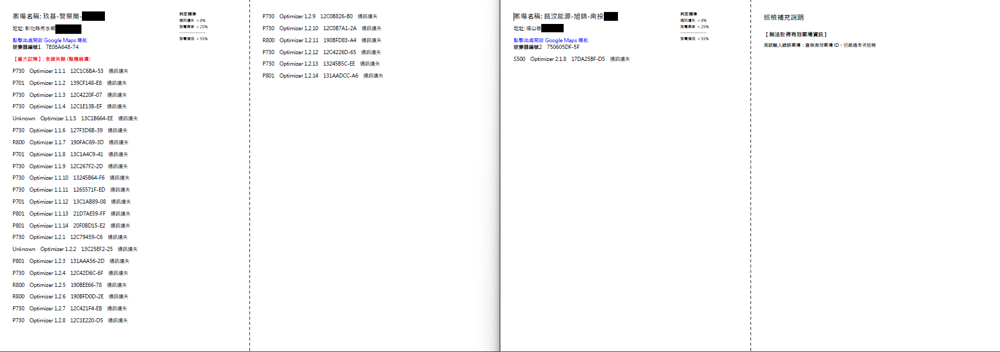

# SolarEdge 太陽能案場自動化巡檢與資料校正系統 (Ops & QA Automation Framework)

本專案為基於 **Python + Selenium** 開發的自動化巡檢與資料一致性校正系統，主要應用於 SolarEdge 太陽能監控平台之多案場維運流程。

系統目的在於降低人工巡檢成本，並解決實務上常見的問題，包括：
- 案場 ID 錯配或缺失
- UI 操作耗時且不穩定
- 前端 DOM 結構變動導致腳本失效
- 多來源資料不一致（Excel / Lobby / API）

系統核心採用「資料驗證 + 自動修復 + 回寫機制」的閉環設計，使巡檢流程可自我修正並持續運行。

## 📊 Pipeline 工作流程架構 (System Workflow)

本專案專為多案場維運流程所打造，底層採用 **Pipeline-based Architecture（管線化架構）** 設計，拆分為明確的 Stage 與 Step，具備高可讀性、容錯性與可擴充性：

```mermaid
flowchart TD
    A[Excel 案場清單讀取] --> B[Stage 1: Selenium 登入與頁面導覽]
    B --> C[Stage 2: Metadata Recovery / 缺失 ID 補辦]
    C --> D[Stage 3: Identity Gate / 資料一致性校正]
    D --> E[Stage 4: CDP Network Logs 攔截與解析]
    E --> F[Stage 5: Device Mapping / 設備樹遍歷]
    F --> G[Stage 6: Status Analysis / 基準線演算法判定]
    G --> H[Stage 7: Persistence / Excel 數據落盤]
    H --> I[Stage 8: PDF Report / 自動化運維報表生成]
    
🖥️ 實時自動化巡檢狀態 (Execution Screen)
以下為系統執行自動化巡檢、觸發 CDP 底層監聽，並在偵測到資料錯配時自動啟動 Lobby fallback 機制之實時畫面（已遮蔽敏感個資）：



🧠 核心功能設計
1. 案場 ID 一致性驗證（Identity Gate）
系統會自動比對 Excel 中的 site_name / site_id 與 API 回傳的實際 site name。若發現不一致，將觸發 Lobby 重新查詢、重新取得正確 site_id、更新 runtime 狀態並回寫 Excel。此機制可有效避免錯誤案場資料污染後續分析流程。

2. CDP Network 資料擷取
透過 Chrome DevTools Protocol（CDP）取得 Network logs，直接擷取後端 JSON response。這大幅減少了對前端 DOM 結構的依賴，提高資料擷取的穩定性（降低 DOM selector fragility）。

3. Lobby fallback 修復機制
當 API 查詢結果與預期不符時，系統會自動返回 Lobby 頁面，使用搜尋功能重新定位案場，並從搜尋結果取得正確 site_id 進行落盤修正。

4. 資料清洗與型別控制
為避免 Excel / Pandas 自動型別轉換造成資料錯誤，強制將 site_id 以 string 格式處理，避免數字自動去除前導 0，統一資料寫入格式。

5. 報表自動生成
系統最終會自動輸出視覺化 PDF 報表，包含案場基本資訊、發電數據統計、異常設備標記與維運建議資訊。

📄 運維成果展示 (Inspection Report Output)
以下為系統巡檢完畢後自動產出之雙頁 PDF 運維報表示例（已遵循企業資安規範遮蔽敏感個資）：



⚙️ 技術亮點
低依賴 UI 自動化設計： Selenium 用於流程控制，CDP 用於資料擷取，繞過 SPA 渲染延遲並大幅降低腳本脆弱度。

多來源資料驗證機制： 整合 Excel（主清單）、API（系統真實狀態）與 Lobby 搜尋結果（fallback），透過三方比對確保資料一致性。

多層級資料解析（Hierarchical data processing）： 對設備資料進行多層級遍歷與統計，精確計算出健康的發電基準值並標記異常設備。

Session 保留模式（Debug Friendly）： 支援 browser session保留，方便維運人員人工檢查當前狀態或調試自動化流程。

🚀 快速開始 (Quick Start)
1. 安裝環境依賴
pip install -r requirements.txt

2. 準備案場清單
於根目錄準備 Sites_sample.xlsx（可參考專案提供之範本），欄位需包含 site_name 與 site_id。

3. 執行自動化巡檢
python main.py

🔒 資安與使用聲明 (Privacy & Security Notice)
本系統已移除所有真實登入資訊與敏感資料，僅保留結構與流程示意。公開展示之數據與範本皆已替換為虛擬測試資料，符合企業內部資安合規標準。
