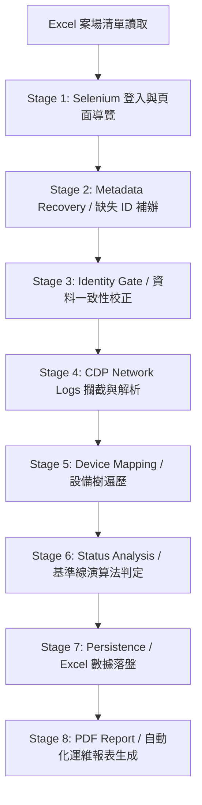

# SolarEdge Automated Inspection System

📝 Project Overview
這是一套用於 SolarEdge Monitoring Platform 的自動化巡檢系統。

系統會自動登入 SolarEdge 平台，攔截 Network Response，解析站點設備資訊，分析優化器健康狀態，並自動同步 Excel 資料庫以及產生 PDF 巡檢報告。

系統目的在於降低人工巡檢成本，並解決實務上常見的問題，包括：
- 案場 ID 錯配或缺失
- UI 操作耗時且不穩定
- 前端 DOM 結構變動導致腳本失效
- 多來源資料不一致（Excel / Lobby / API）

系統核心採用「資料驗證 + Fallback 容錯 + 回寫機制」的架構設計，旨在提升巡檢流程的成功率與自動化強健性。

---

## 📊 Pipeline 工作流程架構 (System Workflow)

本專案專為多案場維運流程所打造，底層採用 **Pipeline-based Architecture（管線化架構）** 設計，拆分為明確的 Stage 與 Step，具備高可讀性、容錯性與可擴充性：



🖥️ 實時自動化巡檢狀態 (Execution Screen)
以下為系統執行自動化巡檢、觸發 CDP 底層監聽，並在偵測到資料錯配時自動啟動 Lobby fallback 機制之實時畫面（已遮蔽敏感個資）：


---

📈 發電狀態判定演算法 (Status Analysis Logic)

```text
Optimizer 數據擷取 
  └── 按 Model 型號分組 (Group by Model)
        └── 計算該型號前 50% 高發電設備平均值 (Model Benchmark)
              └── 實時對比偏離比率 (Compare Ratio)
                    ├── Normal (正常發電)
                    ├── Low Output (發電偏低 < 55%)
                    ├── Abnormal (發電異常 < 25%)
                    └── Communication Lost (通訊遺失)
```
---

## 🧠 核心功能與功能清單 (Features)

本系統核心採用「資料驗證 + 自動修復 + 回寫機制」的閉環設計，旨在提升巡檢流程的成功率與自動化強健性：

✔ Selenium 自動登入與流程控制

✔ Chrome DevTools Protocol (CDP) 底層網路攔截： 繞過 SPA 渲染延遲，直接獲取最純粹的後台 JSON 數據封包。

✔ 自動修復 Site ID (Metadata Recovery)： 盲搜大廳並補齊缺失資料。

✔ 案場身分錯配驗證 (Identity Gate)： 確保資料一致性（Data Consistency）。

✔ 動態基準線發電判定演算法 (Status Analysis Logic)

✔ Excel 資料同步 (Excel Data Synchronization)

✔ 自動化視覺化維運 PDF 報表生成

✔ 特定異常情境之容錯與重試機制 (Exception Handling & Retry Flow)

---

## 🎛️ 關鍵設計決策 (Design Decisions)

- **低依賴 UI 自動化設計（CDP 攔截）：** 使用 Chrome DevTools Protocol（CDP）直接擷取後端 JSON response，顯著降低對脆弱前端 DOM 結構的依賴，大幅提升腳本在網頁改版時的穩定度（Mitigate DOM selector fragility）
- **多來源資料驗證機制（Identity Gate）：** 整合 Excel（主清單）、API（系統真實狀態）與 Lobby 搜尋結果（fallback）。比對 API 案場全名與 Excel 紀錄，若出現 mismatch 立即啟動安全攔截並重新盲搜，避免錯誤 Site ID 造成後續發電分析的資料污染。
- **資料清洗與強型別控制（Data Integrity）：** 強制將 site_id 以 String 格式載入 Pandas DataFrame 處理，徹底杜絕數值型態轉換自動去除「前導 0」的現象，確保資料落盤的完整性。

---

## 📁 專案結構與成果展示 (Structure & Output)
```text
SolarEdgeInspection/
│
├── main.py                     # 核心管線驅動主程式 (Pipeline Engine)
├── requirements.txt            # 環境依賴描述清單
├── Sites_sample.xlsx           # 案場主資料庫範本 (Excel DB)
│
├── workflow.png                # 系統執行實時畫面
└── report.png                  # 自動化生成 PDF 報表樣張
```

---

## 🛠️ 技術棧與核心工具 (Technical Stack)
核心語言： Python 3.x

自動化控制： Selenium WebDriver, Chrome DevTools Protocol (CDP)

資料處理與清洗： Pandas (Excel Processing)

網路傳輸： Requests, JSON Parsing

報表引擎： FPDF (Automated PDF Generation)

## 🚀 快速開始 (Quick Start)
1. 安裝環境依賴
pip install -r requirements.txt

2. 準備案場清單
於根目錄準備 Sites_sample.xlsx，欄位需包含 site_name 與 site_id。

3. 執行自動化管線
python main.py

---

## 🔒 隱私與資安聲明 (Privacy & Security Notice)
本專案已全面移除、隱匿所有敏感案場金鑰、企業登入憑證與真實地址。公開展示之數據與範本皆已替換為虛擬測試資料，符合企業內部資安合規標準。
